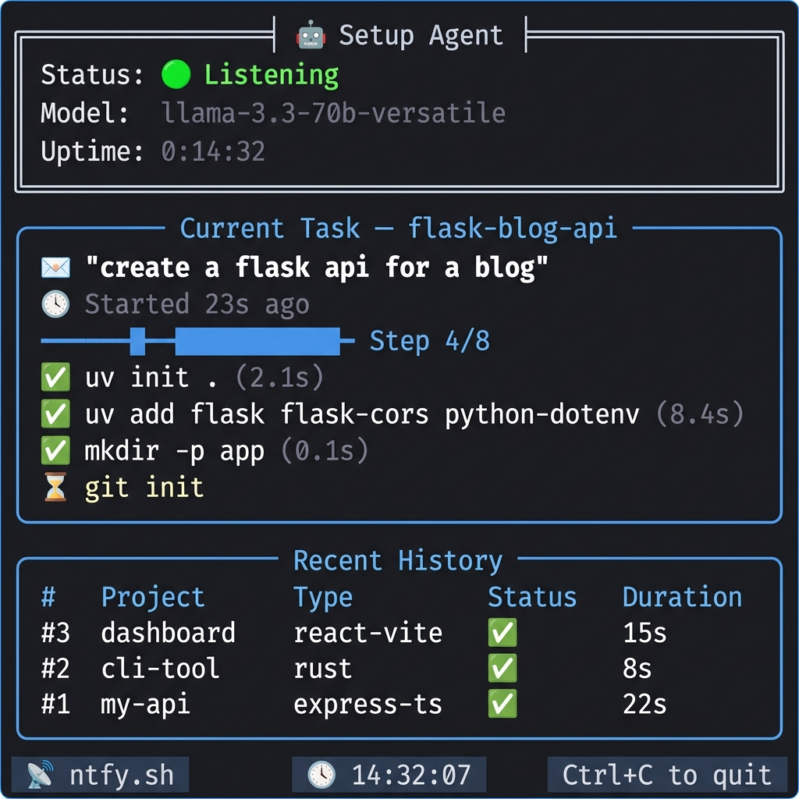
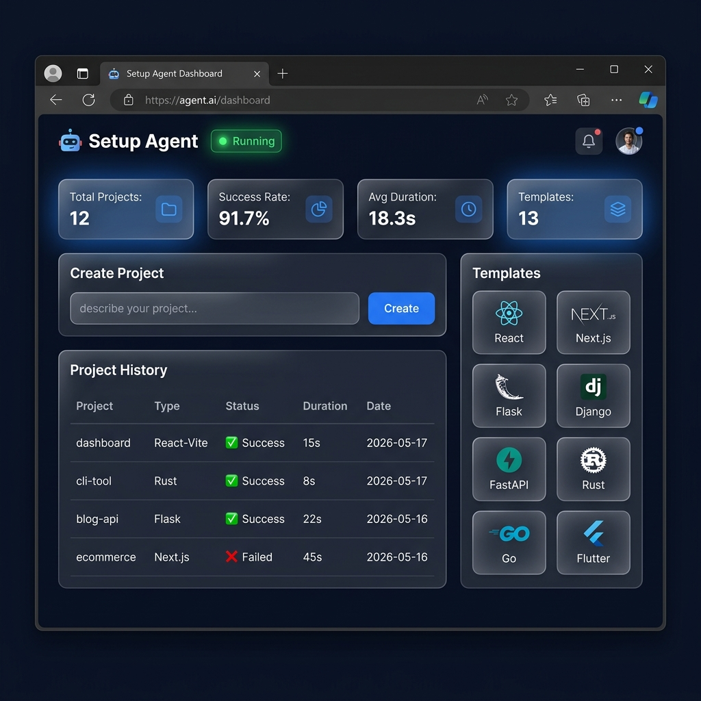
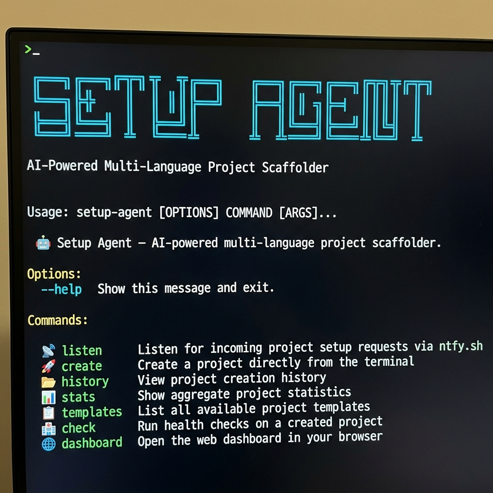

# 🤖 Setup Agent

**AI-powered multi-language project scaffolder** — send a message from your phone or terminal, get a fully configured project on your laptop with a beautiful live dashboard.

<p align="center">
  
  
  
  
  
  
</p>

---

## 📸 Screenshots

<p align="center">
  
  <br>
  <em>Rich terminal dashboard — live status, progress tracking, and project history</em>
</p>

<p align="center">
  
  <br>
  <em>Web dashboard — real-time stats, project history, and template browser</em>
</p>

<p align="center">
  
  <br>
  <em>Professional CLI — 7 subcommands for every workflow</em>
</p>

---

## ✨ Features

| Feature | Description |
|---------|-------------|
| 🎨 **Rich Terminal Dashboard** | Beautiful live-updating TUI with status panels, progress tracking, and command history |
| 🌐 **Web Dashboard** | Browser-based dashboard at `localhost:8745` with real-time stats and one-click project creation |
| 📱 **Phone-to-Laptop Pipeline** | Send natural language via [ntfy.sh](https://ntfy.sh) → agent scaffolds the project → sends completion notification |
| 🧠 **Multi-Language AI Agent** | Supports **13 project types** across 7 ecosystems — auto-detects your intent |
| 🔄 **Auto-Rollback** | Failed setups are automatically cleaned up |
| 🏥 **Health Checks** | Verify projects work — TypeScript compilation, package integrity, git status |
| 📊 **Project History** | SQLite-backed database tracking every project with timing and stats |
| 🖥️ **Professional CLI** | Click-based CLI with 7 subcommands |
| 🔒 **Hardened Sandbox** | Command allowlisting, shell injection prevention, path sandboxing |

---

## 🚀 Supported Project Types

| Category | Templates | Package Manager |
|----------|-----------|-----------------|
| **Frontend** | React (Vite), Next.js, Svelte, Vanilla Vite | npm / npx |
| **Backend (JS)** | Express + TypeScript | npm |
| **Backend (Python)** | Flask, Django, FastAPI | uv |
| **Python** | Plain Python project | uv |
| **TypeScript** | Plain TypeScript | npm / tsc |
| **Systems** | Rust, Go | cargo / go |
| **Mobile** | Flutter | flutter |

---

## 📦 Quick Start

### Prerequisites

- Python 3.12+
- [uv](https://docs.astral.sh/uv/) package manager
- [ntfy.sh](https://ntfy.sh) app on your phone
- A free [Groq API key](https://console.groq.com)

### Install

```bash
git clone https://github.com/rajashekarpatha07/SetUp-Agent.git
cd SetUp-Agent
uv sync
```

### Configure

```bash
cp .env.example .env
# Edit .env with your API key and ntfy topics
```

```env
# Required
GROQAPI=your_groq_api_key_here

# Notifications (ntfy.sh)
NTFY_INBOX_TOPIC=your-unique-inbox-topic
NTFY_UPDATE_TOPIC=your-unique-updates-topic

# Optional
LLM_MODEL=llama-3.3-70b-versatile
PROJECTS_DIR=/home/you/Desktop/Projects
HOOK_OPEN_VSCODE=true
WEB_PORT=8745
```

---

## 🖥️ Usage

### CLI Commands

```bash
# Listen for phone messages (with live dashboard + web UI)
setup-agent listen

# Listen without dashboards
setup-agent listen --no-dashboard --no-web

# Create a project directly from terminal
setup-agent create "react app with tailwind"

# Dry run — show matched template without executing
setup-agent create --dry-run "flask api for a blog"

# View project history
setup-agent history
setup-agent history --limit 5
setup-agent history --json-output

# Show aggregate statistics
setup-agent stats

# List available templates
setup-agent templates

# Run health check on a project
setup-agent check my-project-name

# Open web dashboard in browser
setup-agent dashboard
```

### Example Messages

```
"create a react app called dashboard"
"set up a python flask api for a blog"
"make a next.js app with tailwind"
"initialize a rust project called cli-tool"
"create an express typescript api with jwt and mongodb"
"set up a fastapi project"
"make a go project called web-scraper"
"create a django project for an e-commerce site"
```

---

## 🏗️ Architecture

```
📱 Phone (ntfy.sh)  ──→  main.py (listener + queue)
🖥️  Terminal (CLI)   ──→       │
🌐 Web Dashboard     ──→       │
                              ▼
                         agent.py (LangChain + Groq LLM)
                              │
                    ┌─────────┼─────────┐
                    ▼         ▼         ▼
              tools.py   templates.py  hooks.py
                    │
              ┌─────┼─────┐
              ▼     ▼     ▼
          sandbox  history  rollback
              │
              ▼
        subprocess (shell commands)
```

---

## 📁 Project Structure

```
SetUp-Agent/
├── src/
│   └── setup_agent/           # Main Python package
│       ├── __init__.py        # Package init + version
│       ├── agent.py           # LangChain agent (the brain)
│       ├── cli.py             # Click CLI with 7 subcommands
│       ├── config.py          # Centralized env-based config
│       ├── dashboard.py       # Rich Live terminal dashboard
│       ├── healthcheck.py     # Per-language project verification
│       ├── history.py         # SQLite project history database
│       ├── hooks.py           # Post-setup hooks (VS Code, start commands)
│       ├── logger.py          # Structured logging (console + file)
│       ├── main.py            # Listener, queue, lifecycle orchestration
│       ├── notifier.py        # ntfy.sh communication + rate limiting
│       ├── rollback.py        # Auto-rollback on setup failure
│       ├── sandbox.py         # Security layer (command + path validation)
│       ├── templates.py       # 13 project template definitions
│       ├── tools.py           # Sandboxed tools the LLM can invoke
│       └── web/
│           ├── __init__.py
│           ├── server.py      # HTTP API server
│           └── index.html     # Browser-based dashboard UI
├── docs/
│   └── screenshots/           # Screenshots for README
├── data/                      # SQLite DB (git-ignored)
├── logs/                      # Log files (git-ignored)
├── .env.example               # Example configuration
├── .gitignore
├── CONTRIBUTING.md
├── LICENSE
├── README.md
└── pyproject.toml
```

---

## 🔒 Security

| Layer | Protection |
|-------|-----------|
| **Command Allowlist** | Only approved programs can run (npm, uv, git, cargo, etc.) |
| **Shell Injection** | `&&`, `;`, `\|`, `` ` ``, `$()` all blocked |
| **Destructive Commands** | rm, sudo, kill, shutdown blocked |
| **Path Sandboxing** | All operations confined to `PROJECTS_DIR` |
| **Path Traversal** | `../` blocked, paths resolved before checking |
| **Command Length** | 500 char limit prevents LLM hallucination exploits |
| **Input Validation** | Adversarial prompt injection patterns rejected |
| **Request Queue** | Max 5 queued requests prevents resource exhaustion |
| **Auto-Rollback** | Failed setups are automatically cleaned up |

---

## 🛠️ Tech Stack

- **AI**: LangChain + Groq (Llama 3.3 70B)
- **Terminal UI**: Rich (live dashboard, tables, panels)
- **CLI**: Click
- **Web**: Vanilla HTML/JS + Tailwind CSS CDN
- **Database**: SQLite (stdlib)
- **Notifications**: ntfy.sh
- **Package Manager**: uv

---

## 🤝 Contributing

Contributions are welcome! See [CONTRIBUTING.md](CONTRIBUTING.md) for guidelines.

## 📄 License

This project is licensed under the MIT License — see the [LICENSE](LICENSE) file for details.
